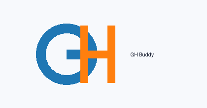

# GH Buddy - RAG-Based Student Chatbot




GH Buddy is a Retrieval-Augmented Generation (RAG) chatbot for students.  
It can ingest PDFs, DOCX, TXT, and web URLs, retrieve relevant context using ChromaDB, and answer questions with either **Google Gemini** or **Hugging Face Inference API**.

## Features
- Student-friendly chatbot with concise answers.
- RAG pipeline with `sentence-transformers/all-MiniLM-L6-v2` embeddings.
- Multi-source ingestion: PDF, DOCX, TXT, and URLs.
- UI model toggle: **Gemini 🤖** / **Hugging Face 🤗**.
- Source references included in responses.
- Reset vector store and clear chat history options.
- Chat logging to CSV.
- Docker support and GitHub Actions CI workflow.

## Project Structure
```text
GH-Buddy-Chatbot/
├── data/
├── src/
│   ├── app.py
│   ├── create_vectorstore.py
│   ├── load_documents.py
│   ├── rag_chain.py
│   └── utils.py
├── logo/
├── docs/
├── .github/workflows/deploy.yml
├── .env.example
├── Dockerfile
├── generate_logo.py
├── generate_report.py
├── generate_sample_data.py
└── requirements.txt
```

## Setup
### 1) Clone and install
```bash
git clone <your_repo_url>
cd GH-Buddy-Chatbot
python -m venv .venv
# Windows
.venv\Scripts\activate
# macOS/Linux
source .venv/bin/activate
pip install -r requirements.txt
```

### 2) Configure environment variables
Copy `.env.example` to `.env` and add keys:
```env
GEMINI_API_KEY=your_key_here
HUGGINGFACE_API_KEY=your_key_here
```

> If keys are missing, GH Buddy still works and responds with: `Please set your API keys.`

### 3) Generate sample assets and report
```bash
python generate_sample_data.py
python generate_logo.py
python generate_report.py
```

### 4) Run locally
```bash
streamlit run src/app.py
```

## Run with Docker
```bash
docker build -t gh-buddy .
docker run -p 8501:8501 --env-file .env gh-buddy
```

## Usage
1. Open Streamlit app.
2. Upload files and/or add URLs in sidebar.
3. Click **Process & Add to Vector Store**.
4. Pick a model with the sidebar toggle.
5. Ask questions in the chat box.
6. View context sources below each answer.

## Screenshots
- Chat interface: `docs/screenshots/chat_placeholder.png` (placeholder)
- Sidebar ingestion controls: `docs/screenshots/sidebar_placeholder.png` (placeholder)

## Live Demo
- [Live Demo Placeholder](https://example.com/gh-buddy-demo)

## CI/CD
- GitHub workflow at `.github/workflows/deploy.yml` runs dependency install, asset generation, report generation, and Python compile checks.
- Deployment to Streamlit Cloud is typically done by linking this repository directly in Streamlit Cloud dashboard.

## Contributing
Contributions are welcome!  
Please open an issue first for major changes and submit pull requests with clear descriptions.

## License
MIT License.
