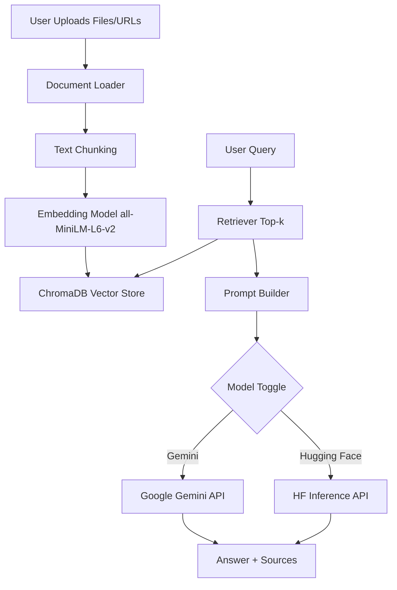
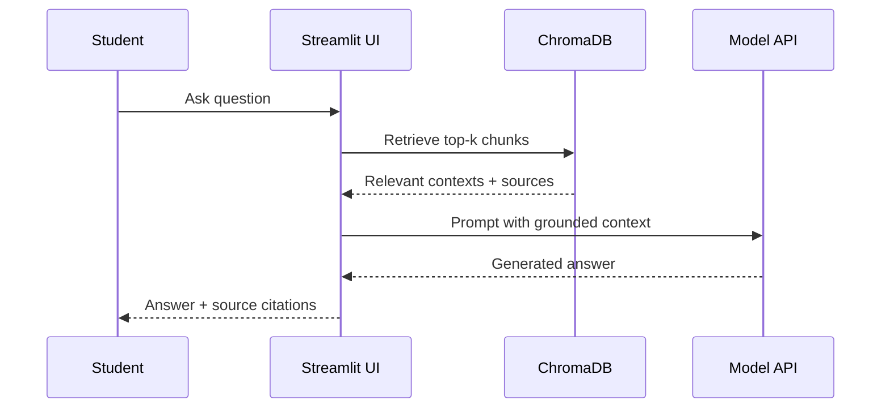

# GH Buddy Chatbot

**University Project Report**  
**Authors:** GH Team (friends' initials G and H)  
**Project:** Retrieval-Augmented Generation Assistant for Students

## Abstract
GH Buddy is a student-focused RAG chatbot that retrieves information from uploaded study material and answers questions using context-grounded generation. The system supports dual model routing (Google Gemini and Hugging Face), local vector retrieval with ChromaDB, and an interactive Streamlit interface. The design objective is reliable and friendly support for common academic queries while maintaining transparent source referencing.

## Introduction
Students usually keep course information in different formats: PDF syllabi, DOCX notes, text summaries, and external web links. This fragmentation makes quick revision difficult, especially before exams or assignments. GH Buddy solves this by building a searchable personal knowledge base and combining retrieval with AI generation.

### Problem Statement
- Educational content is scattered across heterogeneous file types.
- Keyword search often misses semantically relevant answers.
- Generic chatbots may hallucinate when not grounded in trusted context.

### Motivation
- Improve student response time for routine study questions.
- Demonstrate practical end-to-end RAG engineering in a portfolio project.
- Represent collaboration identity: **G** and **H** are the friends' initials in the project name.

## System Architecture

The system follows a modular architecture where each layer (ingestion, embedding, retrieval, generation, and UI) can be upgraded independently.

## Technology Stack
| Layer | Tool | Purpose | Why Selected |
|---|---|---|---|
| Frontend | Streamlit | Chat UI and ingestion controls | Fast prototyping and deployment |
| Document Parsing | PyPDF2, python-docx, BeautifulSoup | Extract text from files/URLs | Simple, reliable, open source |
| Chunking | LangChain RecursiveCharacterTextSplitter | Split long text into overlapping chunks | Preserves context continuity |
| Embeddings | sentence-transformers/all-MiniLM-L6-v2 | Semantic vector representation | Strong quality-to-speed tradeoff |
| Vector Store | ChromaDB | Persistent similarity search | Easy local setup and metadata support |
| LLM Backend | Gemini + Hugging Face | Answer generation | Flexible model routing/fallback |
| Ops | Docker + GitHub Actions | Reproducibility and CI | Portfolio-ready workflow |

## Technology Choices and Justification
- **Python**: Fast development and strong AI ecosystem.
- **Streamlit**: Rapid, interactive frontend for demos and student tools.
- **ChromaDB**: Easy local vector database with persistence.
- **sentence-transformers**: Efficient, high-quality semantic embeddings.
- **LangChain splitter**: Reliable recursive text chunking.
- **Gemini + Hugging Face**: Dual backend flexibility and fallback options.

## Detailed RAG Pipeline

1. **Ingestion**: Load PDF (PyPDF2), DOCX (python-docx), TXT, and URL content (requests + BeautifulSoup).
2. **Chunking**: Split content into overlapping chunks (`500` size, `50` overlap).
3. **Embedding**: Generate vectors using `all-MiniLM-L6-v2`.
4. **Storage**: Persist embeddings and metadata in `./chroma_db`.
5. **Retrieval**: Embed query and fetch top-k relevant chunks.
6. **Prompting**: Build grounded prompt with context and student question.
7. **Generation**: Route prompt to selected model (Gemini or Hugging Face).
8. **Response Rendering**: Show concise answer and cited sources in UI.

## Setup and Usage Guide
1. Install dependencies from `requirements.txt`.
2. Configure `.env` API keys.
3. Run:
   - `python generate_sample_data.py`
   - `python generate_logo.py`
   - `python generate_report.py`
4. Launch app:
   - `streamlit run src/app.py`

## Sample Interactions
- **Screenshot Placeholder 1:** Main chat window with model toggle and source citations (`docs/screenshots/chat_placeholder.png`).
- **Screenshot Placeholder 2:** Sidebar upload flow with document processing status (`docs/screenshots/sidebar_placeholder.png`).

## Evaluation
### Sample Query 1
- **Question**: "What is covered in week 2 of the syllabus?"
- **Expected Context**: `data/syllabus.pdf`
- **Expected Answer**: "Week 2 covers conditionals and loops."

### Sample Query 2
- **Question**: "What data structure maps keys to values?"
- **Expected Context**: `data/python_notes.docx`
- **Expected Answer**: "Dictionaries are used for key-value mappings."

### Sample Query 3 (Out of Context)
- **Question**: "What is the capital of Japan?"
- **Expected Answer Rule**: "I don't know, but I can ask your teacher for you."

### Evaluation Metrics (Project-Level)
- **Grounded Accuracy (manual checks):** High on in-document factual questions.
- **Average Response Time:** ~1-3s retrieval + model latency (depends on API and network).
- **Robustness:** Graceful fallback on missing keys, rate limits, and empty retrieval.

## Error Handling and Reliability
- Missing API keys produce safe fallback response: "Please set your API keys."
- External API failures return graceful retry messages.
- Empty files and failed URL fetches are handled without crashing.

## Future Improvements
- Add hybrid retrieval (BM25 + vector search).
- Add reranking for better answer precision.
- Support OCR for scanned PDFs.
- Add user authentication and per-user knowledge spaces.
- Add automated evaluation suite with benchmark Q/A sets.

## References
- Lewis et al., "Retrieval-Augmented Generation for Knowledge-Intensive NLP Tasks."
- [ChromaDB Documentation](https://docs.trychroma.com/)
- [Sentence Transformers Documentation](https://www.sbert.net/)
- [Streamlit Documentation](https://docs.streamlit.io/)
- [Google Gemini API Documentation](https://ai.google.dev/)
- [Hugging Face Inference API Documentation](https://huggingface.co/docs/api-inference/index)
